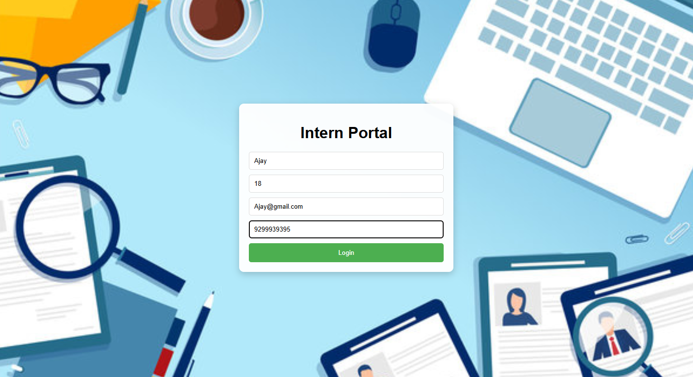
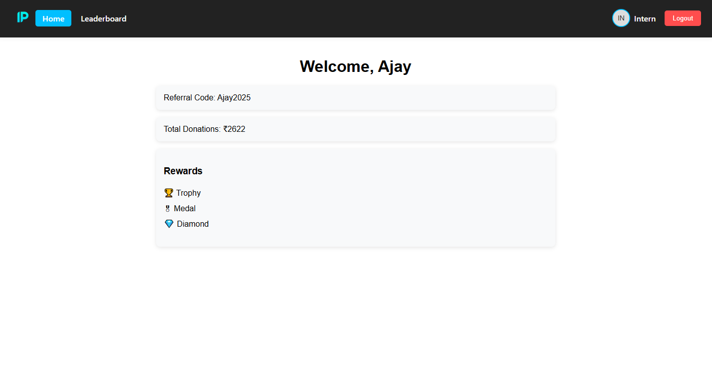
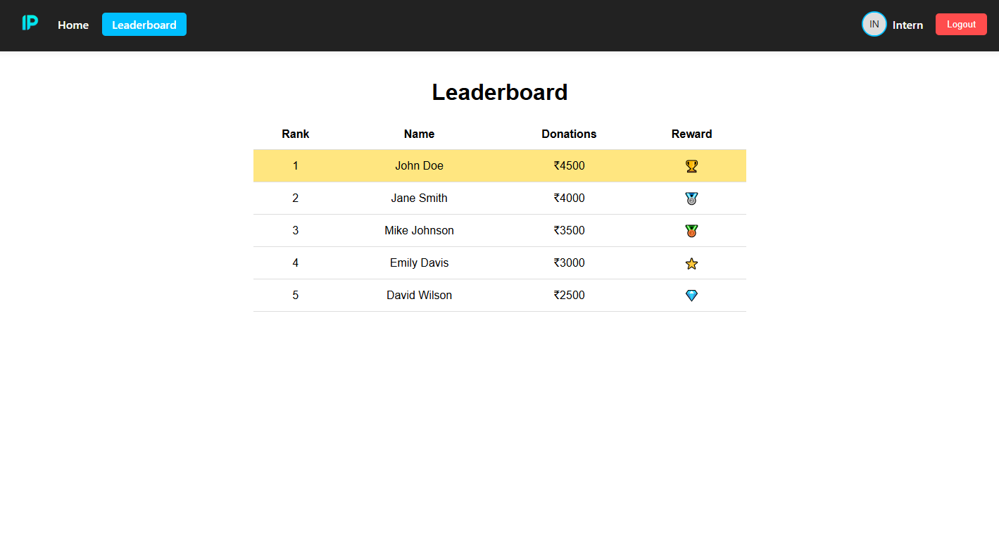

# Intern Portal

A simple **full-stack web application** for managing interns, donations, and leaderboards.  
Built using **React (frontend)** and **Express (backend)** with **static & dynamic data**.

---

## Features

### **Login Page**

- Collects **Name, Age, Email, Phone**
- Validates required fields before login
- Saves user data in `localStorage`
- Redirects to **Dashboard** after login

### **Dashboard**

- Shows welcome message with intern's name
- **Dynamic referral code** → `{name}2025`
- **Random static donations** between ₹1000–₹5000
- **Random rewards** from a predefined list (with icons)
- Styled cards for better UI

### **Leaderboard**

- Displays static list of top donors (from backend API)
- Sorted by donation amount (highest first)
- Shows **reward icons** for top ranks
- Highlight for top donor row

### **Navbar**

- Appears after login
- Links to **Home (Dashboard)** and **Leaderboard**
- **Logout** button clears user data and redirects to Login

---

## 🛠 Tech Stack

**Frontend:**

- React
- React Router DOM
- CSS for styling

**Backend:**

- Node.js
- Express.js
- CORS for cross-origin API calls

---

## Screenshots

### Login Page

### Dashboard

### Leaderboard

